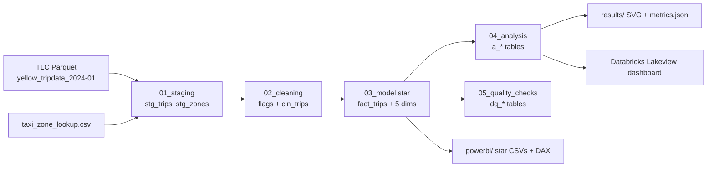

# da-learn-15 · NYC yellow taxi trips (January 2024)

A data-analyst learning project. It analyses the NYC TLC yellow-taxi trip records for **one documented month (January 2024, 2,964,624 raw trips)**. Raw Parquet goes through SQL staging, cleaning, a star schema, analysis and quality checks. DuckDB runs it locally on the **full** month and Databricks SQL runs the same pipeline. The outputs are a published Lakeview dashboard, a Power BI kit and SVG charts.

## Business questions
1. When does demand peak (hour of day, weekday vs weekend, day of month)?
2. Where do trips start, and which origin-destination pairs dominate?
3. How do fare, fare per mile and tipping change with trip distance?
4. How do riders pay, and how much do card riders tip?
5. How large is the airport segment (JFK, LaGuardia, Newark) and how does it price?
6. How dirty is the raw feed (refunds, zero distances, impossible speeds, out-of-month timestamps)?

## Pipeline


## Headline insights (full data, 2,858,847 valid trips)
- **Volume:** 92,221 valid trips a day and **$78.04M** gross revenue. The average fare is $18.45 and the average total $27.30, for 3.30 mi and 15.0 min. Thursdays are busiest at 103,706 trips per day and Mondays quietest at 78,306. The quietest single day was Sun 2024-01-07 (64,871).
- **Time of day:** demand climbs all day to a peak at 18:00 (205,643 trips in the month, 6,925 per weekday). The trough is 04:00 (15,132). Weekend nights are about 3x weekday nights at 00:00 (4,685 vs 1,624 per day). Midday traffic averages 11.5–12 mph, against 22.6 mph at 05:00.
- **Geography:** 89.75% of pickups are in Manhattan. The top zones are Upper East Side South (139,822), Midtown Center (139,820) and JFK Airport (136,950). The busiest route is Upper East Side South → North (21,615 trips, $8.90 average fare). Airports supply 7.85% of trips. JFK averages a $62.96 fare and $81.07 total, and 51.3% of JFK pickups use the flat-fare rate code.
- **Price and tips:** fare per mile falls from **$10.78 under 1 mi** to $3.75 over 20 mi. Card tips also fall with distance, from **30.3% of fare** on short hops to 17.3% on 20+ mi. Credit cards carry 80.22% of trips at a 22.64% average tip. Cash is 14.67%, with tips recorded as $0.
- **Data quality:** 105,777 rows (3.57%) were removed. These were 60,430 with distance ≤0 or >100 mi, 38,387 with non-positive or >$500 fares (refunds and voids), 37,104 with durations under 1 min or over 3 h, 1,107 faster than 80 mph and 18 out of month (the earliest is dated 2002). Another 140,162 trips have payment_type 0 with NULL passenger_count. They are kept and flagged.

## How to run
```bash
pip install -r requirements.txt
python run_pipeline.py --source sample       # data/raw/ sample (29 rows), results in results/sample/
python scripts/download_full_data.py         # ~50 MB into data/raw_full/ (SHA-256 checked)
python run_pipeline.py --source full         # full month: results/, powerbi/data/, ~60 s
python scripts/build_databricks.py           # regenerates the databricks/ notebook + dashboard
```
`scripts/make_sample.py` rebuilds the committed sample from the full file.

## Databricks
The notebook `databricks/nyc_taxi_pipeline_notebook.sql` ran on the Serverless Starter Warehouse in `workspace.da_learn_15`. The dashboard **"da-learn-15 NYC taxi trips"** has 8 widgets and was published on 2026-10-02 at 22:24 IST. All 11 table row counts match DuckDB, and 9 analysis/DQ tables match cell for cell (`databricks/run_outputs/`). See `databricks/SETUP.md`.

## Repo layout
```
data/raw/            29-trip sample + zone subset (full month via scripts/download_full_data.py)
sql/                 00 DuckDB shims, 01 staging, 02 cleaning, 03 star model, 04 analysis, 05 quality checks
run_pipeline.py      DuckDB runner (sample | full)
scripts/             project config, sample builder, downloader, SVG charts, Databricks generator
results/             RESULTS.md, metrics.json, JSON.shot, charts/*.svg (dashboard.svg = overview)
databricks/          exported notebook, .lvdash.json, run outputs, SETUP.md
powerbi/             star CSVs (sample-sized), measures.dax, model.md, dashboard_spec.md, BUILD_GUIDE.md
```

## Caveats
- This is one winter month. January has holidays (Jan 1, MLK Day on Jan 15) and 4 or 5 of each weekday, so the per-day averages are normalised by the day counts.
- Cash tips are not recorded in TLC data, so tip rates are for card payments only.
- payment_type 0 rows (4.0%) are kept in revenue but come from flex-fare or unknown sources. Zones 264/265 (unknown or outside NYC, 9,964 trips) are kept as "Unknown" and "N/A".
- Fares are metered fares. Congestion, airport and MTA surcharges sit in total_amount. The 2025 congestion-pricing fee does not apply to this month.

## Complete dataset
- **Source:** NYC Taxi & Limousine Commission, TLC Trip Record Data: https://www.nyc.gov/site/tlc/about/tlc-trip-record-data.page
- **Kaggle page:** https://www.kaggle.com/datasets/usmanshams/nyc-yellow-taxi-dataset-2024 (the same TLC monthly Parquet files plus the zone lookup)
- **Mirror used (exact URLs):**
  - https://d37ci6vzurychx.cloudfront.net/trip-data/yellow_tripdata_2024-01.parquet
  - https://d37ci6vzurychx.cloudfront.net/misc/taxi_zone_lookup.csv
- **Licence:** public data published by NYC TLC under the NYC Open Data terms of use (free to use, no warranty).
- **Total size:** 49,973,972 bytes (~50.0 MB)
- **Files:** `yellow_tripdata_2024-01.parquet` (49,961,641 B, 2,964,624 rows × 19 columns; SHA-256 `c4d59da7…2030510`) and `taxi_zone_lookup.csv` (12,331 B, 265 zones; SHA-256 `1a99e105…222c8ed`)
- **Download:** `python scripts/download_full_data.py` (writes to data/raw_full/ and verifies SHA-256)
