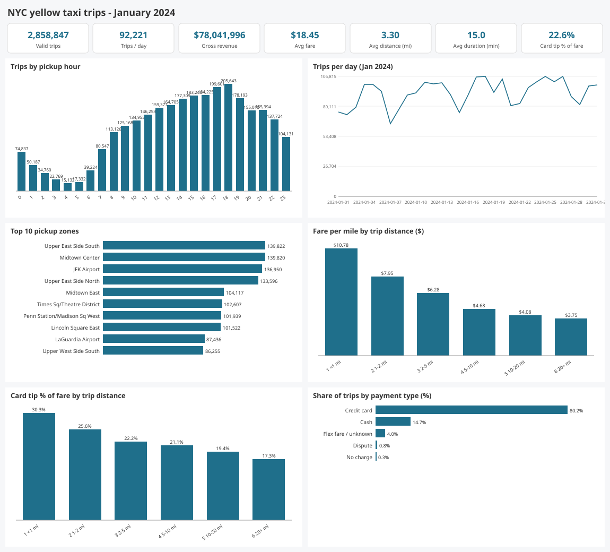
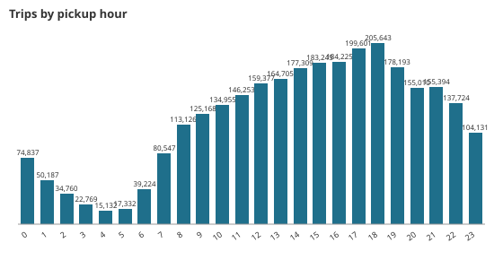
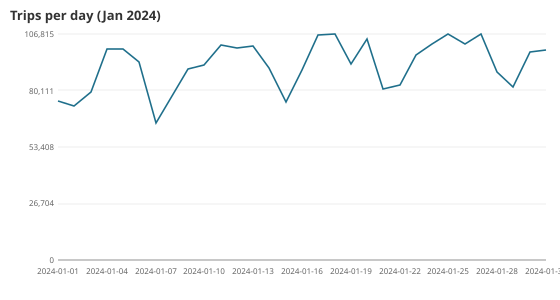
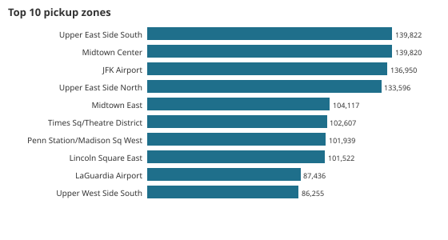
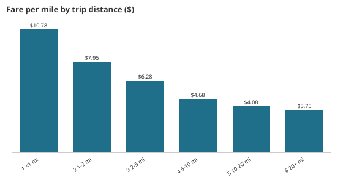
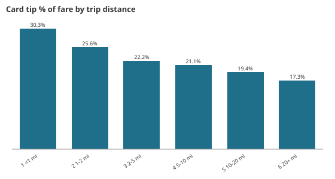
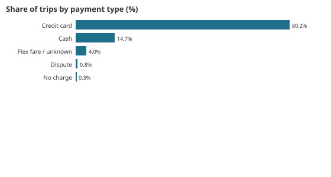

# Results: NYC yellow taxi, January 2024 (full data)

Generated by `python run_pipeline.py --source full` from 2,964,624 raw trips. Every number comes from `metrics.json` and `tables/`, and is reproduced on Databricks (`databricks/run_outputs/duckdb_vs_databricks.json`).

## KPIs
| Metric | Value |
|---|---|
| Valid trips | 2,858,847 |
| Trips per day | 92,221 |
| Gross revenue (total_amount) | $78,041,996 |
| Average fare / average total | $18.45 / $27.30 |
| Average distance / duration | 3.30 mi / 15.0 min |
| Card share of trips | 80.22% |
| Card tip as % of fare | 22.64% |
| Airport pickup share | 7.85% |

## Demand by hour

The peak is 18:00 with 205,643 trips (6,925 per weekday, 5,796 per weekend day). The low is 04:00 with 15,132. At midnight, weekends run at 4,685 per day against 1,624 on weekdays. Average speed is lowest at 17:00 (11.5 mph).

## Daily pattern

The busiest days were Sat 01-27 (106,815), Thu 01-18 (106,646) and Thu 01-25 (106,635). The quietest were Sun 01-07 (64,871), Tue 01-02 (72,654) and MLK Day, Mon 01-15 (74,456). Average trips per day by weekday: Thu 103,706, Sat 101,399, Fri 98,740, Wed 95,834, Tue 89,515, Sun 81,299 and Mon 78,306.

## Where trips start

| Borough | Trips | Share | Average fare | Average miles | Card tip % |
|---|---|---|---|---|---|
| Manhattan | 2,565,888 | 89.75% | $14.90 | 2.31 | 23.86% |
| Queens | 255,217 | 8.93% | $52.82 | 12.86 | 20.19% |
| Brooklyn | 22,022 | 0.77% | $28.73 | 6.19 | 5.80% |
| Bronx | 5,708 | 0.20% | $32.35 | 7.76 | 0.58% |

| Airport | Pickups | Average fare | Average total | JFK flat-fare share |
|---|---|---|---|---|
| JFK | 136,950 | $62.96 | $81.07 | 51.27% |
| LaGuardia | 87,436 | $42.31 | $66.37 | 0.16% |
| Newark | 16 | $81.26 | $100.43 | 0% |

The top origin-destination pairs are short Upper East Side hops. South → North has 21,615 trips and North → South 19,176.

## Price, distance and tips
 

| Band | Share | Average fare | $/mile | Minutes | Card tip % |
|---|---|---|---|---|---|
| <1 mi | 22.96% | $7.45 | $10.78 | 5.9 | 30.30% |
| 1–2 mi | 34.16% | $11.39 | $7.95 | 10.6 | 25.61% |
| 2–5 mi | 26.88% | $18.61 | $6.28 | 17.6 | 22.19% |
| 5–10 mi | 8.10% | $33.91 | $4.68 | 25.7 | 21.10% |
| 10–20 mi | 6.88% | $60.82 | $4.08 | 39.6 | 19.42% |
| 20+ mi | 1.02% | $89.68 | $3.75 | 49.8 | 17.32% |

## Payment

The mix is credit card 80.22% (average total $28.02, tip 22.64%), cash 14.67% (tips not recorded), flex/unknown 4.02%, dispute 0.75% and no charge 0.34%.

## Data quality (`tables/dq_*.csv`)
| Check | Rows |
|---|---|
| distance ≤0 or >100 mi | 60,430 |
| fare ≤0, total ≤0 or fare >$500 | 38,387 |
| duration <1 min or >3 h | 37,104 |
| implied speed >80 mph | 1,107 |
| pickup outside Jan 2024 | 18 |
| **rows removed (any rule)** | **105,777 (3.57%)** |
| payment_type 0 / NULL passengers (kept, flagged) | 140,162 |
| passenger_count 0 (kept) | 31,465 |
| pickup zone 264/265 unknown (kept) | 9,964 |

All 9 assertions PASS. They cover fact completeness, the month window, FK integrity for zone, payment and date, positive measures, hourly sum = fact rows, and unique zone ids.
